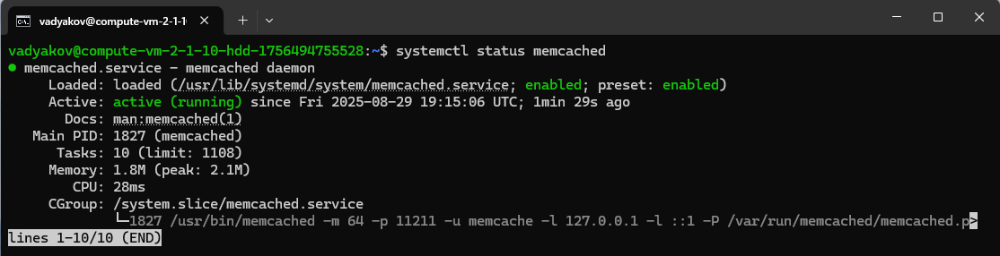

# Домашнее задание к занятию «Кеширование Redis/memcached» - Дьяков Владимир

### Задание 1. Кеширование 

Приведите примеры проблем, которые может решить кеширование. 

*Приведите ответ в свободной форме.*

**Решение**

- **DNS-кэширование:**
    - ускорение доступа к сайтам — хранит соответствие доменных имен и IP-адресов;
    - снижение нагрузки на DNS-серверы;
    - быстрые ответы при повторных запросах к известным доменам;
- **CDN:**
    - быстрая доставка контента через географически распределенные серверы;
    - снижение нагрузки на основной сервер;
    - минимизация задержек за счет размещения контента ближе к пользователю;
    - высокая доступность контента при сбоях основного сервера;
- **HTTP-кэширование:**
    - сохранение статических ресурсов (изображения, CSS, JavaScript);
    - уменьшение нагрузки на сервер при повторных запросах;
    - ускорение загрузки страниц для пользователей;
    - оптимизация использования сетевого трафика;
- **кэш процессора:**
    - ускорение работы программ за счет хранения часто используемых данных;
    - снижение задержек при доступе к памяти;
    - повышение производительности вычислительных операций;
    - оптимизация работы с оперативной памятью;
- **кэширование запросов к базе данных:**
    - снижение нагрузки на СУБД;
    - ускорение получения данных при повторных запросах;
    - экономия ресурсов сервера базы данных;
    - оптимизация часто выполняемых сложных запросов;
    - уменьшение времени отклика приложения.

---

### Задание 2. Memcached

Установите и запустите memcached.

*Приведите скриншот systemctl status memcached, где будет видно, что memcached запущен.*

**Решение**

---

### Задание 3. Удаление по TTL в Memcached

Запишите в memcached несколько ключей с любыми именами и значениями, для которых выставлен TTL 5. 

*Приведите скриншот, на котором видно, что спустя 5 секунд ключи удалились из базы.*

**Решение**

---

### Задание 4. Запись данных в Redis

Запишите в Redis несколько ключей с любыми именами и значениями. 

*Через redis-cli достаньте все записанные ключи и значения из базы, приведите скриншот этой операции.*

**Решение**

---

### Задание 5*. Работа с числами 

Запишите в Redis ключ key5 со значением типа "int" равным числу 5. Увеличьте его на 5, чтобы в итоге в значении лежало число 10.  

*Приведите скриншот, где будут проделаны все операции и будет видно, что значение key5 стало равно 10.*

**Решение**

